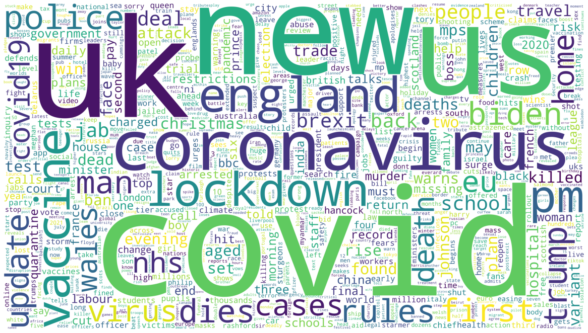

# What does a year of the top items on the BBC News website look like?

I've been scraping the top ten headlines on the BBC News website, on the hour every hour, since July 2020.

In answering this question we'll examine a year of these headlines from 28th July 2020 (the first full day of data scraping) to 27th July 2021.

In that period our data captures 10 headlines, every hour, every day, for a year. That means there are 10x24x365=87,600 headline 'slots' in this period.

A headline, of course, can run for a few hours. But we'll count each 'slot' it occupies, because running for longer is likely to signify more importance.

Above, you can see a wordcloud representing the frequency of words in a year of those headlines.

The Top 50 most used words are as follows:

|    | Word        |   Mentions |
|---:|:------------|-----------:|
|  1 | covid       |      12050 |
|  2 | uk          |       7615 |
|  3 | us          |       4524 |
|  4 | new         |       4275 |
|  5 | coronavirus |       3888 |
|  6 | england     |       3847 |
|  7 | vaccine     |       3739 |
|  8 | lockdown    |       3728 |
|  9 | pm          |       3401 |
| 10 | police      |       3120 |
| 11 | trump       |       3052 |
| 12 | update      |       2519 |
| 13 | dies        |       2483 |
| 14 | man         |       2417 |
| 15 | rules       |       2372 |
| 16 | first       |       2296 |
| 17 | biden       |       2187 |
| 18 | virus       |       1738 |
| 19 | eu          |       1711 |
| 20 | cases       |       1664 |
| 21 | home        |       1664 |
| 22 | covid19     |       1554 |
| 23 | death       |       1547 |
| 24 | nhs         |       1418 |
| 25 | wales       |       1398 |
| 26 | people      |       1396 |
| 27 | deal        |       1373 |
| 28 | school      |       1367 |
| 29 | brexit      |       1357 |
| 30 | jab         |       1334 |
| 31 | back        |       1301 |
| 32 | christmas   |       1274 |
| 33 | rise        |       1243 |
| 34 | found       |       1236 |
| 35 | set         |       1231 |
| 36 | travel      |       1217 |
| 37 | two         |       1204 |
| 38 | deaths      |       1178 |
| 39 | ban         |       1142 |
| 40 | test        |       1137 |
| 41 | win         |       1113 |
| 42 | may         |       1102 |
| 43 | evening     |       1097 |
| 44 | face        |       1088 |
| 45 | children    |       1083 |
| 46 | johnson     |       1074 |
| 47 | attack      |       1071 |
| 48 | trade       |       1070 |
| 49 | dead        |       1069 |
| 50 | plan        |       1068 |

It's no surprise that pandemic-specific words dominated in this period:
|    | Word        |   Mentions |
|---:|:------------|-----------:|
|  1 | covid       |      12050 |
|  5 | coronavirus |       3888 |
|  7 | vaccine     |       3739 |
|  8 | lockdown    |       3728 |
| 18 | virus       |       1738 |
| 20 | cases       |       1664 |
| 22 | covid19     |       1554 |
| 24 | nhs         |       1418 |
| 30 | jab         |       1334 |
| 40 | test        |       1137 |

The US election, presidential inauguration, and a lot of unrest and controversy around those happened in this period, explaining the ranking of these words:
|    | Word        |   Mentions |
|---:|:------------|-----------:|
|  3 | us          |       4524 |
| 11 | trump       |       3052 |
| 17 | biden       |       2187 |

Brexit also happened in this period:
|    | Word        |   Mentions |
|---:|:------------|-----------:|
| 19 | eu          |       1711 |
| 29 | brexit      |       1357 |
| 48 | trade       |       1070 |

You can view and reproduce the analysis behind this research in a [Jupyter Notebook](https://github.com/steveparks/journalism-research/blob/main/jupyter-notebooks/BBCNews-year1-wordcloud.ipynb).
